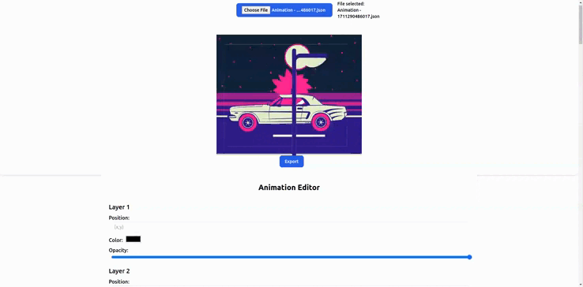

## Project Title: After Effects Animation Editor

### Description

This repository contains a web-based application designed to edit Adobe After Effects animation files. Users can import an After Effects animation file and utilize the application's interface to modify animation properties such as layer positions, colors, and opacities. The application provides functionalities for animation playback, editing, and rendering the edited animation onto an HTML canvas element. Finally, users can export the edited animation as a single HTML/JS file for rendering.

**Task Details:**

- **Input:** Accept/import an After Effects animation file as input.
- **Functionality:**
  - **Animation Playback:** Play the loaded After Effects animation within the UI.
  - **User Interface:** Design a UI for editing animation properties.
  - **Animation Editing:** Implement functionalities to modify the animation based on user interactions.
  - **Canvas Rendering:** Render the edited animation onto an HTML canvas element.
  - **Export:** Export the edited animation as a single HTML/JS file.

**Usage:**
To utilize this project:

1. Clone the repository: `git clone https://github.com/MubarekHussen/After-Effects-Web-Editor`
2. Navigate to the project directory: `cd After-Effects-Web-Editor`
3. Install dependencies: `npm install`
4. Run the development server: `npm run dev`

### User Interface Preview

